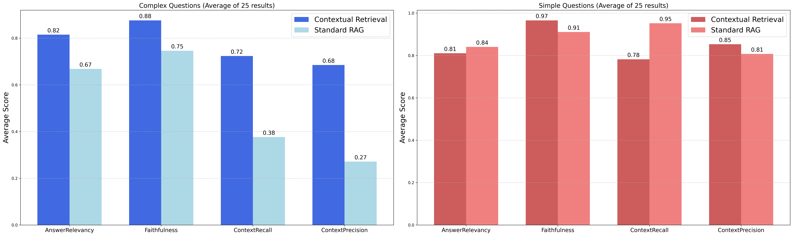

# Contextual Retrieval with Amazon Bedrock and OpenSearch

This project implements [Contextual Retrieval](https://www.anthropic.com/news/contextual-retrieval), as introduced by Anthropic, using Amazon Bedrock, Amazon OpenSearch Service and Cohere Reranker Model. 

## What is Contextual Retrieval?
- Problem: Traditional RAG often provides incomplete information due to chunk size limitations.
- Solution: Provide the entire document as context along with each chunk to create chunk-specific context.

## Note on Contextual Retrieval and Prompt Caching:
Contextual Retrieval is a preprocessing technique that can be implemented without prompt caching. While prompt caching can improve cost-effectiveness and performance, __the current implementation using Amazon Bedrock does not include this feature__. Prompt caching support will be added in future updates when Bedrock makes it available.

In our tests processing the entire manual for Amazon Bedrock (1600+ pages, https://d1jp7kj5nqor8j.cloudfront.net/bedrock-manual.pdf) with the Claude 3 Haiku model in us-west-2, the preprocessing costs were under $20 even without prompt caching. However, generating the situated context took approximately 5 times longer without using asynchronous calls.

Sample usage statistics:
- Input Tokens: 58,573,002 (Cost: $14.64)
- Output Tokens: 385,712 (Cost: $0.48)
- Total Tokens: 58,958,714

Note: Costs may vary significantly depending on prompt and document length.


## Key Features (Demo.)

- Streamlit-based chatbot application using Bedrock's LLM and embedding models
- Multi-turn conversations with chat history

#### Preprocessing

- PDF upload and preprocessing support in the chat interface
- OpenSearch integration for storing preprocessed chunks


#### Searching

- Rank fusion implementation
    - Hybrid Search implementation using KNN and BM25 scores
    - API Gateway and Lambda configuration for serving the Rerank API
    - Reranking with Cohere Rerank 3 Nimble model deployed on Amazon SageMaker


#### Evaluation (RAGAS)

- Evaluation based on RAGAS metrics
    - Answer Relevancy / Faithfulness / Context Recall / Context Precision
- The evaluation time increases proportionally with the number of metrics being evaluated and the number of rows in the evaluation dataset.


## Test Results

- Amazon Bedrock Manual documents (Total 50 Q&A)
    - 1600+ pages
    - 25 Complex Q&A / 25 Simple Q&A
    - Top-K = 5
    - Rank-Fusion (Hybrid Search + Reranker)



## Installation

1. Clone this repository
2. Install dependencies:
```
pip install -r requirements.txt
```
3. Set up the vector store and reranker model (see [USAGE.md](USAGE.md) for details)
4. Configure the `.env` file (see [USAGE.md](USAGE.md) for format)

## Usage

1. Run the chatbot application:
```
streamlit run rag-chatbot.py
```

2. Access the application through the provided URL in your browser
3. Configure Bedrock settings, preprocess documents, and adjust search settings as needed

For detailed instructions on setup and usage, please refer to [USAGE.md](USAGE.md).
